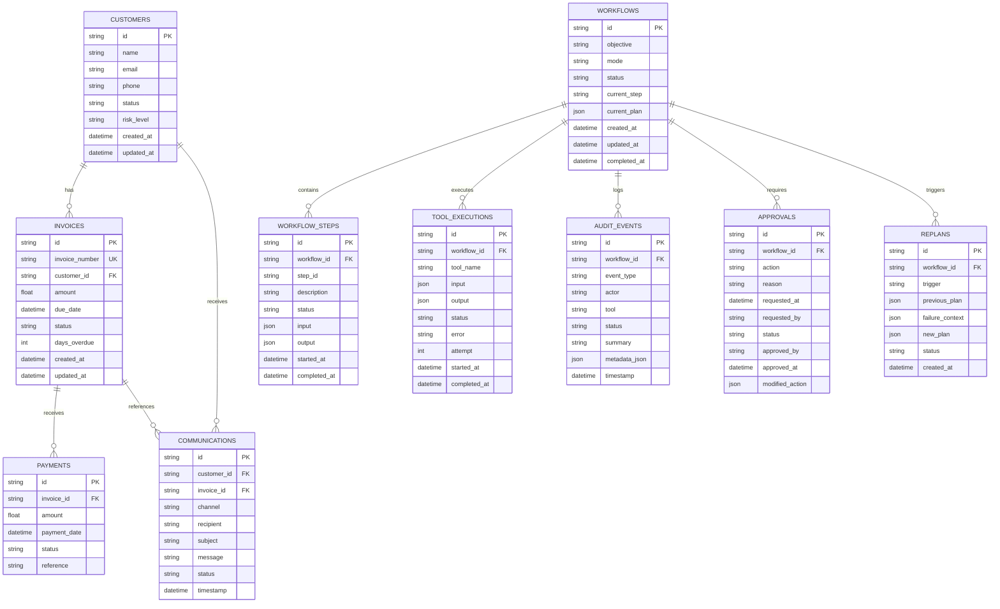

# FlowPilot AI — Database Schema & Architecture

## 1. Overview
FlowPilot's data persistence layer uses **SQLAlchemy 2.0** ORM to interface with PostgreSQL (production) or SQLite (testing). The schema guarantees strict referential integrity, transactional consistency across agent actions, and immutable auditability.

---

## 2. Entity Relationship Diagram (ERD)

---

## 3. Detailed Table Specifications

### A. Business Domain Tables
- **`customers`**: Stores debtor / partner client records. `id` serves as a stable external key (e.g. `cust-1`). `phone` is used for alternative contact numbers or secondary email fallbacks.
- **`invoices`**: Financial liabilities tracked by the system. `days_overdue` and `amount` drive deterministic escalation policies.
- **`payments`**: Reconciles incoming cash transactions against open invoices.
- **`communications`**: Records all outbound messages (emails, SMS) dispatched during workflow execution.

### B. Execution & State Tables
- **`workflows`**: The central state tracking table for an autonomous objective. Tracks current operational status (`IN_PROGRESS`, `WAITING_FOR_APPROVAL`, `COMPLETED`, `FAILED`).
- **`workflow_steps`**: Granular breakdown of individual steps generated by the dynamic planner.
- **`tool_executions`**: Transactional record of every single tool execution, tracking input parameters, return values, errors, and execution timestamps.
- **`approvals`**: Manages human-in-the-loop review tickets. Records whether an action was authorized, who approved it, and any human modifications.
- **`replans`**: Explicit log of workflow recovery events, showing the exact previous plan, the failure error trace, and the newly synthesized recovery plan.
- **`audit_events`**: Immutable, append-only log of all events across the system lifecycle.
